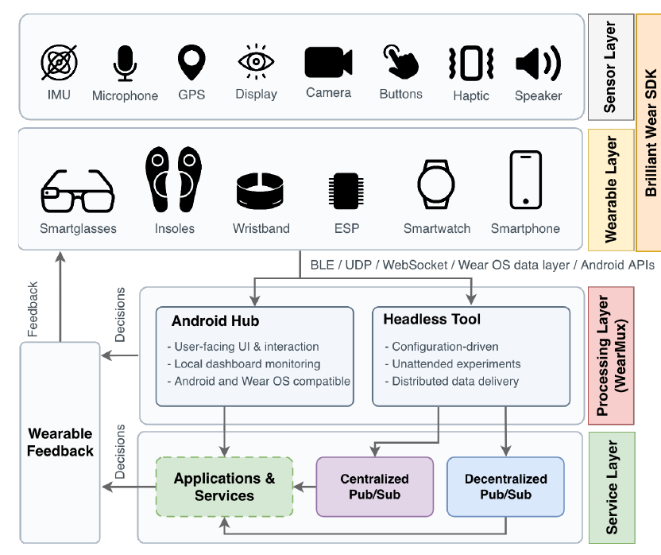

# WearMux Headless

WearMux Headless is the Node.js host in the WearMux toolchain. It connects compatible Brilliant Wear devices through the [Brilliant Wear JavaScript SDK](https://github.com/brilliantsole/BrilliantWear-JavaScript-SDK), acquires wearable data, and makes it available to local or distributed applications. See the [Brilliant Wear website](https://brilliantwear.com/) for information about its hardware and platform.

This repository complements the [WearMux Android hub](https://github.com/nap-it/wearmux-android), which handles phone sensors and Wear OS integration. The two hosts share an architecture but have different device coverage. This branch also includes a direct Wi-Fi watch adapter; its [client requirements](docs/technical-guide.md#wear-os-watches) are documented in the technical guide.

## Key Features

- **Capability-based device sessions:** discover compatible devices over Bluetooth Low Energy and use configured Wi-Fi transports where supported by the device firmware.
- **Multimodal acquisition:** collect camera images, microphone audio, inertial and other sensor streams, including pressure where available.
- **Wearable feedback:** send supported display and haptic actions to connected devices, plus beeps and alerts to Wear OS watches.
- **Local or distributed processing:** run consumers on the host or forward data and actions through MQTT or Zenoh.
- **Multi-device operation:** manage concurrent device sessions, reconnections, and device-tagged modality data.
- **Optional consumer examples:** connect separate speech-to-text and object-detection processes; these are not part of the core runtime.

## Citation

If you use WearMux in your research, please consider citing *WearMux: Real-Time Multimodal Sensing and Feedback across Heterogeneous Wearables*.

```bibtex
@unpublished{Tavares2026WearMux,
    author = {Tavares, Guilherme and Soares, Rafael and Clérigo, André and Silva, Gonçalo and Silva, Gabriel and Cruz, Tomás and Abrunhosa, João and Laredo, Pedro and Rito, Pedro and Sargento, Susana},
    title = {{WearMux}: Real-Time Multimodal Sensing and Feedback across Heterogeneous Wearables},
    year = {2026},
    note = {WPMC 2026 manuscript}
}
```

## Table of Contents

- [WearMux Headless](#wearmux-headless)
  - [Key Features](#key-features)
  - [Citation](#citation)
  - [Table of Contents](#table-of-contents)
  - [How It Works](#how-it-works)
  - [Supported Devices](#supported-devices)
  - [Requirements](#requirements)
  - [Quick Start](#quick-start)
  - [Basic Usage](#basic-usage)
  - [Documentation and Demonstration](#documentation-and-demonstration)
  - [Authors and Contact](#authors-and-contact)
  - [License](#license)

## How It Works

The Headless host connects compatible wearables to applications. It collects available images, audio, and sensor data, and supports feedback through device displays and haptics.

Applications can process data on the host or another machine using MQTT or Zenoh. The [technical guide](docs/technical-guide.md) describes the Headless modules and their implementation.



*Figure 1 from the WearMux manuscript. This repository implements the Headless host path.*

## Supported Devices

For Brilliant Wear devices, Headless uses the Brilliant Wear JavaScript SDK. Its session runtime reads available camera, microphone, sensor, display, and haptic capabilities from each connected device; it does not maintain a separate adapter for every product model. Wear OS watches use a separate Wi-Fi adapter and share the same session runtime. BLE filters and configured Wi-Fi connections are described in [device discovery in the technical guide](docs/technical-guide.md#device-discovery-and-connection).

| Device / profile | Connection | Capabilities / implementation evidence | Qualification |
| --- | --- | --- | --- |
| Omi Glass 20 | SDK over BLE; Wi-Fi with compatible firmware | SDK-reported capabilities; tap-detection example in the sensor config | Configuration example; the paper names Omi AI glasses |
| Brilliant Frame 12 | SDK over BLE | Motion and tap-detection profile; other capabilities reported by the SDK | Configuration example; the paper names Brilliant Labs Frame |
| Ukaton Insole 44 | SDK over BLE | IMU and pressure-sensor profile | Configuration example; its identity is not equated here with Brilliant Sense + Foot Sensor |
| Brilliant Sense, with or without Foot Sensor | Compatible SDK firmware required | Runtime-reported capabilities | Paper-listed devices; no named Headless configuration profile |
| ESP32-S3 camera board | SDK WebSocket/UDP with compatible firmware | Camera and sensors when reported by the SDK | Conditional SDK path; no separate board adapter |
| Wear OS watch | Compatible client over Wi-Fi | Motion sensors, optional heart rate, haptics, beeps, and alerts | Host adapter implemented; matching PC-mode client is missing from the current Android app. See [client requirements](docs/technical-guide.md#wear-os-watches) |
| Android smartphone | Android host only | Phone APIs | Outside Headless device coverage |

The names and sensor profiles in [the configuration files](config/) are examples, not per-model compatibility guarantees. Actual capabilities depend on device firmware and the SDK. The paper's Table I covers the combined prototype; the two hosts have different device coverage, and similarly named products should only be treated as equivalent once their model and firmware are confirmed.

## Requirements

- Node.js 22.16 or newer.
- A Bluetooth adapter with BlueZ on Linux for BLE connections, or a supported configured Wi-Fi connection.
- Python 3.9 or newer when using the Zenoh bridge.
- FFmpeg on `PATH` for microphone RTSP streaming.

Platform-specific BLE setup, optional dependencies, and Docker requirements are covered in the [technical guide](docs/technical-guide.md#prerequisites).

## Quick Start

1. Clone the repository and install the Node.js dependencies:

   ```bash
   git clone https://github.com/nap-it/wearmux-headless.git
   cd wearmux-headless
   npm install
   ```

2. Configure the connection and transport in `config/config.ini` and the related module files. The default uses Zenoh; follow the [transport setup](docs/technical-guide.md#transport-setup) to install the bridge dependencies and start a router. For local capture without messaging, set `MESSAGE_TRANSPORT=none`.

3. Connect a compatible device and start its supported capabilities:

   ```bash
   npm run sessions
   ```

## Basic Usage

For individual modules, use `npm run camera`, `npm run microphone:rtsp`, `npm run sensors`, or `npm run display -- path/to/image.png`. The complete command list and environment variables are in the [technical guide](docs/technical-guide.md#running-the-host).

Applications can subscribe to modality data and send supported device actions back through the selected transport. See [messaging and reverse actions](docs/technical-guide.md#messaging-and-reverse-actions).

## Documentation and Demonstration

The [technical guide](docs/technical-guide.md) covers project structure, device setup, configuration, data topics, consumer examples, Docker deployment, and troubleshooting. The [consumer guide](examples/consumers/README.md) describes the message contract for separate Whisper and YOLO examples.

The paper demonstrates WearMux in outdoor pedestrian-assistance scenarios involving smartglasses, a smartwatch, a smartphone, and remote processing. Watch the [WearMux demonstration](https://youtu.be/r0GW5SRqzHw).

## Authors and Contact

WearMux is research work by the [Instituto de Telecomunicações' Network Architectures and Protocols Group](https://www.it.pt/Groups/Index/36).

Questions and bug reports: [andreclerigo@ua.pt](mailto:andreclerigo@ua.pt) / [gavftavares@ua.pt](mailto:gavftavares@ua.pt) / [rafael.feliciano@ua.pt](mailto:rafael.feliciano@ua.pt).

## License

WearMux Headless is licensed under the **GNU General Public License v3.0 (GPL-3.0)**. See [LICENSE](LICENSE) for the full terms.
