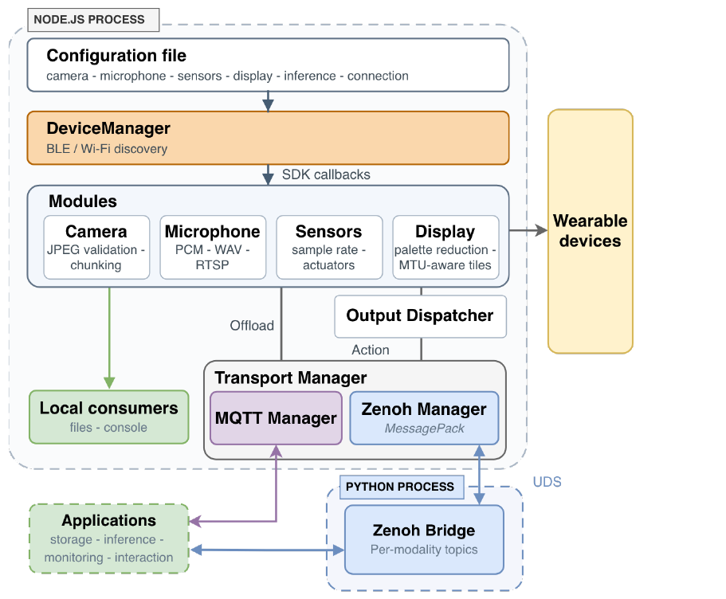

# WearMux Headless Technical Guide

Setup, configuration, messaging, and deployment reference for WearMux Headless. For the project overview, citation, and first-run instructions, see the [README](../README.md).

The SDK-backed device manager and per-device sessions coordinate connections and capabilities. Modality modules acquire and prepare data; transport and action modules connect those capabilities to consumers and device outputs. The diagram below shows these Headless components; their source files are mapped in [Project Structure](#project-structure).



*Headless architecture, reproduced from Figure 4 of the WearMux manuscript supplied with this project.*

## Contents

- [Prerequisites](#prerequisites)
- [Running the Host](#running-the-host)
- [Configuration](#configuration)
- [Core Module Capabilities](#core-module-capabilities)
- [Messaging and reverse actions](#messaging-and-reverse-actions)
- [Published data topics](#published-data-topics)
- [Docker](#docker)
- [Project Structure](#project-structure)
- [Examples](#examples)
- [Troubleshooting](#troubleshooting)
- [Environment Variables](#environment-variables)

## Prerequisites

### Shared requirements

- Node.js 22.16 or newer.
- Python 3.9 or newer for the Zenoh bridge, or when compiling native dependencies.
- FFmpeg on `PATH` for RTSP audio publishing.

### Linux

A Bluetooth adapter with BlueZ is required for BLE connections. Configured Wi-Fi connections do not require a Bluetooth adapter after provisioning.

### Windows

- Windows 10 build 15063+ (required for WinRT BLE API)
- **Visual Studio Build Tools** with "Desktop development with C++" workload and Windows 10 SDK — required to compile the native BLE addon. Install via winget:
  ```
  winget install Microsoft.VisualStudio.2022.BuildTools --override "--quiet --add Microsoft.VisualStudio.Workload.VCTools --add Microsoft.VisualStudio.Component.Windows10SDK.19041 --includeRecommended"
  ```
  Or download manually from [visualstudio.microsoft.com/visual-cpp-build-tools](https://visualstudio.microsoft.com/visual-cpp-build-tools/)
- Ensure `python` is on `PATH` when using the Zenoh bridge or compiling the BLE addon.

## Running the Host

After installing dependencies as described in the project README, run commands from the repository root:

| Command | Purpose |
| --- | --- |
| `npm run sessions` | Discover compatible devices and start their supported capabilities |
| `npm start` | Run the commands selected in the INI configuration |
| `npm run sensors` | Monitor sensors on one device |
| `npm run camera` | Run the camera with the configured capture and viewer settings |
| `npm run microphone:rtsp` | Monitor microphone audio and publish it when `RTSP_URL` is set |
| `npm run microphone:record` | Record device audio to a WAV file |
| `npm run display -- path/to/image.png` | Send an image to a device display |
| `npm run actions` | Receive display and haptic commands on one device |
| `npm run actions:send -- '<JSON>'` | Send a device command and wait for its result |
| `npm run clean:recordings` | Delete files from the recordings directory |

The session runtime owns one connection per device. Do not run standalone camera, sensor, microphone, or action commands alongside `sessions` against the same BLE device. Camera and microphone commands use the same acquisition code as the session runtime.

## Configuration

The npm commands load the INI files in `config/`. Shell variables override INI values, so temporary settings can be supplied without editing files:

```bash
MESSAGE_TRANSPORT=none npm run sessions
```

| File | Settings |
| --- | --- |
| `config.ini` | Shared runtime settings and startup commands |
| `bluetooth.ini` | Device ID/name filters and optional insole side label |
| `wifi.ini` | Device IP address, WebSocket/UDP selection, and Wi-Fi provisioning |
| `sensors.ini` | Enabled sensor types and sampling rates |
| `camera.ini` | Capture, image quality, browser viewer, and image output |
| `audio.ini` | Microphone settings and RTSP publishing |
| `ml.ini`, `tflite.ini` | Optional sensor inference scripts |

In `config/config.ini`, `[env]` defines environment variables and `[scripts]` selects commands for `npm start` and the Docker launcher:

```ini
[env]
MESSAGE_TRANSPORT=zenoh

[scripts]
run=sessions
```

Leave `DEVICE_ID` and `DEVICE_NAME` unset to discover multiple compatible BLE devices. If both are set, the ID filter takes precedence. `DEVICE_IP` adds a configured Wi-Fi connection in the session runtime; standalone commands use it instead of BLE discovery. Set `DEVICE_TRANSPORT=websocket` or `udp` as supported by the device firmware.

Set `WEARMUX_CONFIG_PATH` to select another configuration directory or a single INI file. The [environment variable reference](#environment-variables) lists the main runtime options.

## Core Module Capabilities

Modules use the capabilities exposed by the connected device. The following guides cover focused commands; the environment variable reference below covers shared settings.

| Module guide | Behavior |
| --- | --- |
| [Camera](../camera/README.md) | Single or continuous capture, optional autofocus, image controls, timestamped files, and HTTP/MJPEG viewing |
| [Microphone](../microphone/README.md) | Audio levels, WAV recording, and RTSP publishing at 8 kHz or 16 kHz |
| [Sensors](../sensors/README.md) | Configured motion, pressure, and activity streams; optional host-side gesture scripts |
| [Display](../display/README.md) | Image preprocessing, color reduction, bitmap tiling, and text/prompt actions |

## Messaging and reverse actions

WearMux Headless uses one messaging transport at a time. Set `MESSAGE_TRANSPORT=mqtt`, `zenoh`, or `none`; `config/config.ini` selects Zenoh by default. MQTT uses `mqtt://127.0.0.1:1883` unless `MQTT_BROKER_URL` is set.

The default topic root for both transports is `bwear/`. Set `TOPIC_PREFIX` to change the root, and use the same value on all publishers and subscribers.

For existing configurations, replace `MQTT_ENABLE` or `ZENOH_ENABLE` with `MESSAGE_TRANSPORT`, and replace transport-specific topic prefixes with `TOPIC_PREFIX`. Raw media publishing uses `MIC_RAW_ENABLE` and `CAMERA_RAW_ENABLE`. Set these in `config/` or your shell; the old flags are no longer read.

### Transport setup

For **Zenoh**, install the bridge dependencies in a Python environment and connect to a reachable router. On Linux, create the environment and start the included router from the repository root:

```bash
python3 -m venv venv
venv/bin/python -m pip install -r requirements.txt
docker compose up -d zenoh-router
```

The bridge uses the repository's `venv` interpreter when present, then falls back to `python3` on Linux or `python` on Windows. On Windows, create the environment with `python -m venv venv` and install through `venv\Scripts\python.exe`.

For **MQTT**, connect to a reachable broker or start the included broker with `npm run mqtt:broker` in another terminal. For local acquisition, use **None** (`MESSAGE_TRANSPORT=none`).

### Device actions

The session runtime shares one action subscription across its devices. The standalone `sensors` and `actions` commands receive actions for their single device connection.

Applications publish a JSON object to `bwear/actions`. The action receiver publishes a result to `bwear/actions/result` with the same `id`, an `ok` flag, device identity, and timestamp. `ok` means the device SDK accepted the action call; it does not confirm that the wearer perceived the output. Failed actions also include an `error`. An optional `deviceId` targets one connected device.

In the session runtime, an action without `deviceId` goes to the sole connected device with that capability. If several devices support it, the result asks for `deviceId` instead of sending the action to every device. A device-specific command uses the ID reported on `bwear/devices/status` or in modality messages.

| Action | Fields | Effect |
| --- | --- | --- |
| `display.text` | `text` | Show up to 500 characters on a device display |
| `display.prompt` | `text` | Show a compact centered question |
| `display.clear` | — | Clear the device display |
| `display.image` | `data` | Show a base64 PNG or JPEG, up to 1 MiB |
| `haptic.vibrate` | optional `effect`, `locations` | Trigger a supported SDK vibration effect; defaults to `strongClick100` |

Use the included sender to publish an action and print its result:

```bash
# Default Zenoh configuration; run `npm run sessions` in another terminal first.
npm run actions:send -- '{"action":"display.text","text":"Hello"}'

# Target a specific wristband when more than one device can vibrate.
npm run actions:send -- '{"action":"haptic.vibrate","deviceId":"<wristband-id>"}'

# MQTT, with `npm run mqtt:broker` running in another terminal.
MESSAGE_TRANSPORT=mqtt npm run sessions
MESSAGE_TRANSPORT=mqtt npm run actions:send -- '{"action":"haptic.vibrate"}'
```

## Published data topics

MQTT and Zenoh publish the same logical topics and JSON payloads. The examples below use the default `bwear` root; substitute your `TOPIC_PREFIX` when it differs. For Zenoh, the Node.js connector uses a Python sidecar (`tools/zenoh_py_publisher.py`) over a Unix domain socket with MessagePack framing.

### Sensors (`bwear/sensors/`)

When messaging is enabled, all enabled sensors are automatically published:

- **`bwear/sensors/acceleration`** - 3-axis acceleration data (x, y, z in m/s²)
- **`bwear/sensors/gyroscope`** - 3-axis gyroscope data (x, y, z in rad/s)
- **`bwear/sensors/magnetometer`** - 3-axis magnetometer data (x, y, z in μT)
- **`bwear/sensors/orientation`** - Euler angles (heading, pitch, roll in degrees)
- **`bwear/sensors/linearAcceleration`** - Linear acceleration without gravity
- **`bwear/sensors/gameRotation`** - Game rotation quaternion
- **`bwear/sensors/rotation`** - Rotation quaternion
- **`bwear/sensors/tapDetector`** - Tap detection events
- **`bwear/sensors/gravity`**, **`bwear/sensors/pressure`**, **`bwear/sensors/activity`**, **`bwear/sensors/stepCounter`** - Additional streams when supported and enabled

Each message includes:

```json
{
  "ts": 1234567890,
  "sensor": "acceleration",
  "device": { "id": "CE:59:C3:0F:4D:C9", "name": "BrilliantFrame" },
  "message": { "timestamp": 1234567890, "sensorType": "acceleration", "acceleration": { "x": 0.1, "y": 0.2, "z": 9.8 } }
}
```

### Microphone (`bwear/microphone/`)

When messaging is enabled and a connected device has a microphone:

- **`bwear/microphone/status`** - Microphone connection status
- **`bwear/microphone/level`** - Real-time audio level (RMS, peak, timestamp)
- **`bwear/microphone/raw/meta`** - Raw audio metadata (when `MIC_RAW_ENABLE=1`)
- **`bwear/microphone/raw/chunk`** - Raw audio data chunks in base64 (when `MIC_RAW_ENABLE=1`)

### Camera (`bwear/camera/`)

When messaging is enabled and a connected device has a camera:

- **`bwear/camera/image`** - Image metadata (timestamp, filename, dimensions, etc.)
- **`bwear/camera/raw/meta`** - Raw image metadata (when `CAMERA_RAW_ENABLE=1`)
- **`bwear/camera/raw/chunk`** - Raw image data chunks in base64 (when `CAMERA_RAW_ENABLE=1`)

### Device sessions (`bwear/devices/`)

- **`bwear/devices/status`** - Connection status and discovered capabilities for each device

With multiple cameras, the browser viewers use consecutive ports starting at `CAMERA_VIEW_PORT` (8099 by default), in connection order. A second microphone RTSP stream uses the configured path with `-1` appended, and so on. Media frame IDs include the source device ID so consumer adapters can distinguish simultaneous streams.

### Python Helpers

- **`tools/zenoh_py_publisher.py`** - Sidecar process that receives data via UDS and publishes to Zenoh
- **`tools/zenoh_py_subscriber.py`** - Example subscriber to receive published data

Example subscriber usage with the repository's bridge interpreter:

```bash
venv/bin/python tools/zenoh_py_subscriber.py "bwear/sensors/**"
```

## Docker

This project provides a `docker-compose.yml` for running WearMux Headless and its Zenoh router. Compose mounts the INI files in `config/` and uses the launcher settings described in [Configuration](#configuration). It also provides a MediaMTX server for configured RTSP publishing.

### Start and stop

From the repository root:

```bash
docker compose up --build
```

Stop the stack with:

```bash
docker compose down
```

The Compose file uses host networking and privileged access for Bluetooth on Linux. Host adapter permissions and radio state are covered in [Troubleshooting](#troubleshooting).

### Build on another machine

On a Raspberry Pi, the native Node.js dependencies can make the image build demanding. To reduce build load on the Pi, build the ARM64 image on another machine and publish it to a registry you can access. An ARM64 builder is preferable; an x86 builder can use Docker Buildx with ARM64 emulation.

```bash
docker buildx build --platform linux/arm64 \
  -t registry.example.com/wearmux-headless:arm64 --push .
```

On the Pi, set the image name to the same registry tag and start Compose without building:

```bash
export WEARMUX_IMAGE=registry.example.com/wearmux-headless:arm64
docker compose pull wearmux-headless
docker compose up --no-build
```

The Compose file also supports local builds. The Dockerfile uses the CodeNap `node:22-bookworm-slim` image for both build and runtime stages; access to that registry is required. The runtime must meet the package's Node.js 22.16+ requirement. To use another compatible base image, pass `docker build --build-arg NODE_BASE_IMAGE=...`.

## Project Structure

The core runtime separates device connections, modality acquisition, messaging, and application integrations.

```text
wearmux-headless/
├── camera/         # Capture, validation, and HTTP/MJPEG viewer
├── microphone/     # Audio monitoring, WAV recording, and RTSP publishing
├── sensors/        # Sensor capture, pressure views, and optional ML scripts
├── display/        # Image/text rendering and bitmap tiling
├── actions/        # Standalone action receiver
├── utils/          # Device sessions, fleet, transport, and action dispatcher
├── tools/          # Launchers, Wi-Fi setup, MQTT broker, and Zenoh bridges
├── config/         # INI settings and Zenoh configurations
├── examples/       # Consumers, car interaction, and latency evaluation
├── interactions/   # Application-specific adapters
├── docs/           # This guide and paper figures
├── docker-compose.yml
├── Dockerfile
├── requirements.txt
└── package.json
```

The paper's logical blocks map to the implementation as follows:

| Paper concept | Headless implementation |
| --- | --- |
| Device manager and capability-bearing sessions | `utils/device-manager.js`, `utils/device-fleet.js`, and `utils/device-session.js` |
| Camera, microphone, sensor, and display modules | `camera/`, `microphone/`, `sensors/`, and `display/` |
| Output dispatcher for device actions | `utils/action-dispatcher.js` and `actions/` |
| MQTT/Zenoh transport manager and bridge | `utils/transport.js`, `utils/mqtt-*`, `utils/zenoh-*`, and `tools/zenoh_py_*` |
| Local application and consumer integrations | `interactions/` and `examples/` |

## Examples

Each optional integration has its own setup and message contract:

| Guide | Purpose |
| --- | --- |
| [External consumers](../examples/consumers/README.md) | Standalone Whisper transcription and YOLO detection, with separate Python dependencies and result schemas |
| [Latency evaluation](../examples/latency-evaluation/README.md) | Measure display-to-camera latency with `npm run examples:latency` |
| [Car interaction](../examples/car-interaction/README.md) | Demonstrate application feedback and vehicle interaction |
| [VRU stop-request adapter](../interactions/vru-stop-request/README.md) | Display MQTT prompts and return nod/shake answers |

The core Docker image and Compose stack run acquisition and transport services. Install and start processing consumers separately, on the host or another machine connected to the same broker/router.

## Troubleshooting

### Linux Bluetooth access

For local Node.js processes that report missing raw-socket permissions, grant the executable the required capability:

```bash
sudo setcap cap_net_raw+eip "$(readlink -f "$(command -v node)")"
```

Check that the host's Bluetooth adapter is unblocked and powered on:

```bash
rfkill unblock bluetooth
sudo hciconfig hci0 up
```

The Docker setup uses the host Bluetooth adapter, so its radio state also affects container acquisition.

### No published data or action results

Check `MESSAGE_TRANSPORT`, the broker/router address, and the matching `TOPIC_PREFIX` on both ends. With Zenoh, confirm the Python dependencies are installed in the environment used by the Node.js process. Raw media also requires `MIC_RAW_ENABLE=1` or `CAMERA_RAW_ENABLE=1`.

### No RTSP audio

Set `RTSP_URL` to a reachable RTSP server and check that FFmpeg is available through `FFMPEG_PATH` or `PATH`. A configured `RTSP_ENABLE=0` disables publishing even when the URL is present.

## Environment Variables

These tables cover the main runtime settings. Defaults marked with an INI filename come from the repository configuration. Optional examples document their own additional settings.

### Audio and RTSP

| Variable           | Description                                 | Default                | Example/Values           |
|--------------------|---------------------------------------------|------------------------|--------------------------|
| `RTSP_URL`         | RTSP publish URL; unset disables RTSP       | unset                  | `rtsp://host:8554/mic` |
| `SAMPLE_RATE`      | Microphone sample rate (Hz)                 | `16000`                | `8000`, `16000`          |
| `CHANNELS`         | Audio channels                              | `1`                    | `1`, `2`                 |
| `SAMPLE_FORMAT`    | PCM format for FFmpeg                       | `s16le`                | `s16le`, `f32le`         |
| `AUDIO_BITRATE`    | OPUS bitrate for RTSP                       | `64k`                  | `64k`, `128k`            |
| `FFMPEG_PATH`      | FFmpeg binary path                          | `ffmpeg`               | `/usr/bin/ffmpeg`        |
| `FFMPEG_LOGLEVEL`  | FFmpeg verbosity                            | `error`                | `info`, `warning`        |
| `BIT_DEPTH`        | Audio bit depth                             | `16`                   | `8`, `16`                |
| `RTSP_ENABLE`      | Set to `0` to disable a configured RTSP publisher | `1` when `RTSP_URL` is set | `0`, `1` |

### Device Discovery and Connection

| Variable           | Description                                 | Default   | Example/Values                |
|--------------------|---------------------------------------------|-----------|------------------------------|
| `DEVICE_ID`        | In `sessions`, restrict to one Bluetooth device; unset discovers all compatible devices | unset | Bluetooth ID |
| `DEVICE_NAME`      | Restrict discovery to one advertised device name | unset | `Brilliant Frame 12` |
| `DEVICE_IP` | Add a configured Wi-Fi device; standalone commands use it instead of BLE | unset | `192.168.1.100` |
| `DEVICE_TRANSPORT` | Wi-Fi protocol | `websocket` | `websocket`, `udp` |
| `DEVICE_WIFI_SECURE` | Use TLS for WebSocket connections | `0` | `0`, `1` |
| `DEVICE_SIDE` | Optional side label included in sensor events | unset | `left`, `right` |
| `MIC_DEVICE_ID`    | Legacy alias for `DEVICE_ID`                | unset     | Bluetooth ID                 |
| `MIC_DEVICE_NAME`  | Legacy alias for `DEVICE_NAME`              | unset     | `Brilliant Frame 12`         |

### Sensors

Rates accept a value in Hz or a period such as `20ms`; the SDK uses 5 Hz steps. Unset `ENABLED_SENSORS` lets the session runtime use each device's supported sensors.

| Variable                    | Description                                 | Default | Example/Values              |
|-----------------------------|---------------------------------------------|---------|----------------------------|
| `ENABLED_SENSORS`           | Restrict the session runtime to these sensor types | all supported | `acceleration,gyroscope` |
| `ACCELERATION_RATE`         | Acceleration sensor rate (Hz)               | `50`    | `100`                      |
| `GRAVITY_RATE`              | Gravity sensor rate (Hz)                    | `50`    | `100`                      |
| `GYROSCOPE_RATE`            | Gyroscope sensor rate (Hz)                  | `50`    | `100`                      |
| `MAGNETOMETER_RATE`         | Magnetometer sensor rate (Hz)               | `50`    | `100`                      |
| `ORIENTATION_RATE`          | Orientation sensor rate (Hz)                | `50`    | `100`                      |
| `TAP_DETECTOR_RATE`         | Tap detector rate (Hz)                      | `5`     | `10`                       |
| `LINEAR_ACCELERATION_RATE`  | Linear acceleration rate (Hz)               | `50`    | `100`                      |
| `GAME_ROTATION_RATE`        | Game rotation rate (Hz)                     | `50`    | `100`                      |
| `ROTATION_RATE`             | Rotation rate (Hz)                          | `50`    | `100`                      |
| `ACTIVITY_RATE`             | Activity classification rate (Hz)           | `5`     | `10`                       |
| `STEP_COUNTER_RATE`         | Step counter rate (Hz)                      | `5`     | `10`                       |
| `PRESSURE_RATE`             | Pressure sensor rate (Hz)                   | `50`    | `100`                      |

### Messaging

| Variable | Description | Default |
|----------|-------------|---------|
| `MESSAGE_TRANSPORT` | Select `mqtt`, `zenoh`, or `none` | `zenoh` (config.ini) |
| `TOPIC_PREFIX` | Root for all published and subscribed topics | `bwear` |
| `MQTT_BROKER_URL` | MQTT broker URL, including optional credentials and TLS | `mqtt://127.0.0.1:1883` |
| `ZENOH_ROUTER` | Zenoh router endpoint override | `config/peer.json5` |
| `MIC_RAW_ENABLE` | `1` publishes audio chunks; `0` leaves level/status messages only | `1` (audio.ini) |
| `CAMERA_RAW_ENABLE` | `1` publishes image chunks; `0` leaves metadata only | `1` (camera.ini) |
| `MIC_RAW_THROTTLE_MS` | Minimum interval between raw audio publishes | `200` |
| `RAW_CHUNK_SIZE` | Base64 characters per raw chunk | `30000` |

### Camera

| Variable                | Description                                 | Default   | Example/Values             |
|-------------------------|---------------------------------------------|-----------|---------------------------|
| `CAMERA_OUTPUT_DIR`     | Directory to save JPEG images               | unset     | `./images`                |
| `CAMERA_AUTO_PICTURE`   | `1` captures continuously; `0` captures once | `1` (camera.ini) | `0`, `1` |
| `CAMERA_AUTO_DELAY`     | Delay between continuous captures (ms)      | `0`       | `1000`, `2000`            |
| `CAMERA_AUTO_FOCUS`     | `1` focuses before capture; `0` skips focus  | `0` (camera.ini) | `0`, `1` |
| `CAMERA_CAPTURE_TIMEOUT_MS` | Maximum wait for a captured image (ms)   | `5000` (camera.ini) | `8000` |
| `CAMERA_FOCUS_IDLE_TIMEOUT_MS` | Maximum wait for focus to finish (ms) | `3000`   | `5000`                    |
| `CAMERA_MIN_IMAGE_BYTES` | Reject smaller camera candidates           | `3000` (camera.ini) | `0`, `5000` |
| `CAMERA_RESOLUTION`     | Device-supported numeric SDK resolution     | `480` (camera.ini) | numeric SDK value |
| `CAMERA_WIDTH`, `CAMERA_HEIGHT` | Legacy resolution fallback when `CAMERA_RESOLUTION` is unset | unset | numeric values |
| `CAMERA_QUALITY_FACTOR` | JPEG quality from 0 to 100                  | `60` (camera.ini) | `80`, `100` |
| `CAMERA_QUALITY`        | Legacy alias for `CAMERA_QUALITY_FACTOR`     | unset     | `80`                      |
| `CAMERA_RATE`           | Camera sensor rate; supported values depend on device | `5` | `10` |
| `CAMERA_COMMAND_TIMEOUT_MS` | Wait before continuing from a camera command (ms) | `3000` (camera.ini) | `5000` |
| `CAMERA_VIEW_ENABLE`    | `1` starts an HTTP browser viewer; `0` disables it | `1` (camera.ini) | `0`, `1` |
| `CAMERA_VIEW_HOST`      | Viewer bind address                         | `0.0.0.0` | `127.0.0.1`               |
| `CAMERA_VIEW_PORT`      | Viewer TCP port; more cameras use following ports | `8099` | `8080` |
| `CAMERA_VIEW_MJPEG`     | `1` streams MJPEG; `0` uses browser polling  | `1` (camera.ini) | `0`, `1` |
| `CAMERA_EXPOSURE`       | Device-specific numeric exposure value      | `168` (camera.ini) | device-supported value |
| `CAMERA_AUTO_EXPOSURE_ENABLED` | Numeric flag: `1` on, `0` off         | `0` (camera.ini) | `0`, `1` |
| `CAMERA_AUTO_WHITE_BALANCE_ENABLED`, `CAMERA_AUTO_GAIN_ENABLED` | Device-specific numeric flags | unset | `0`, `1` |
| `CAMERA_SHUTTER`, `CAMERA_GAIN`, `CAMERA_RED_GAIN`, `CAMERA_GREEN_GAIN`, `CAMERA_BLUE_GAIN` | Device-specific numeric controls | unset | device-supported values |
| `CAMERA_BRIGHTNESS`, `CAMERA_SATURATION`, `CAMERA_CONTRAST`, `CAMERA_SHARPNESS` | Device-specific numeric controls | unset | device-supported values |
| `CAMERA_LATENCY_MEASUREMENTS` | Number of images in the latency example | `500` (camera.ini) | positive integer |
| `CAMERA_LATENCY_OUTPUT` | Optional latency results JSON path | unset | `./logs/latency.json` |

### Display

| Variable | Description | Default | Example/Values |
|----------|-------------|---------|----------------|
| `DISPLAY_TIMING` | Log display transfer timing | `0` | `1` |
| `DISPLAY_KEEP_ALIVE` | Keep the display process alive after sending an image | `1` (config.ini) | `0`, `1` |
| `DISPLAY_PIXEL_DEPTH` | Color depth in bits per pixel | automatic | `1`, `2`, `4` |
| `DISPLAY_BRIGHTNESS` | Brightness preset applied by the display command | `medium` | `veryLow`, `low`, `medium`, `high`, `veryHigh` |
| `DISPLAY_FIT` | How to fit the image to the display | `contain` | `contain`, `cover`, `fill`, `inside`, `outside` |
| `DISPLAY_ALIGN` | Image alignment | `center` | `top`, `bottom`, `left`, `right`, `center` |
| `DISPLAY_X`, `DISPLAY_Y` | Top-left image position in pixels | `0`, `0` | integer values |
| `DISPLAY_INPUT_HEIGHT`, `DISPLAY_OUTPUT_HEIGHT` | Image processing and device output heights | device default | positive pixel values |
| `DISPLAY_WIDTH`, `DISPLAY_HEIGHT` | Legacy size fallback | unset | positive pixel values |
| `DISPLAY_TILE_MAX_PIXELS` | Pixel limit per transmitted tile | `220` | positive integer |
