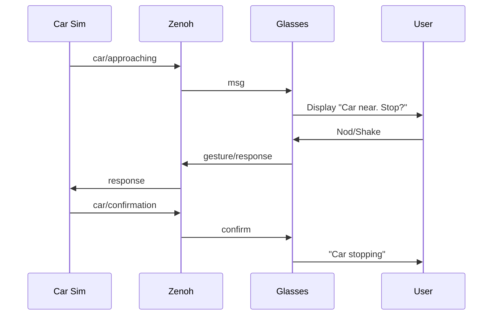

# Car Interaction Example

The car simulator asks a pedestrian wearing compatible glasses whether it should stop. The wearable controller displays the question and returns a nod/shake response through the selected messaging transport.




## Setup

Run commands from the repository root after installing the Node.js dependencies. Connect compatible glasses with a display and motion sensors, and follow the [transport setup](../../docs/technical-guide.md#transport-setup) for MQTT or Zenoh. Both processes must use the same transport and broker/router.

In the first terminal, start the wearable controller with the repository configuration:

```bash
node tools/run-with-config.js examples/car-interaction/glasses-controller.js
```

In the second terminal, start the car simulator:

```bash
npm run examples:car
```

Both commands load the INI files in `config/`; shell variables override those values. The simulator generates an approach every 5–15 seconds. Nod or shake to answer the displayed question. When no answer arrives before the timeout, the simulator applies its timeout behavior.

## Configuration

Device and transport settings use the [shared configuration](../../docs/technical-guide.md#configuration). Example messages, timing, and gesture thresholds are defined in [`constants.js`](constants.js).

## Troubleshooting and Tests

For connection and transport failures, see the [shared troubleshooting guide](../../docs/technical-guide.md#troubleshooting). Gesture model setup and provenance are covered in the [model guide](../../sensors/model/README.md).

Run the example tests with:

```bash
npm run examples:test
```

Run the complete repository suite with `npm test`.
