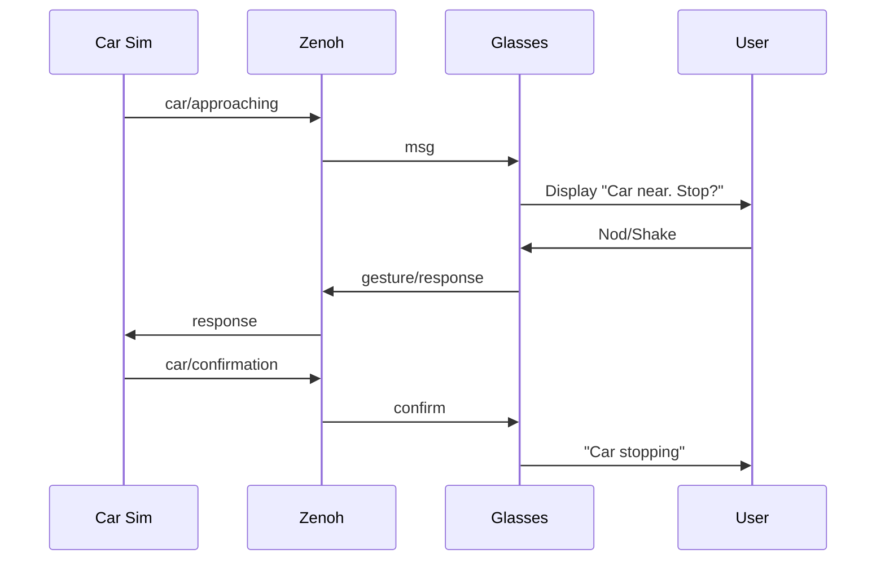

# Car Interaction Demo

AR gesture demo: AV asks pedestrian (glasses) permission to stop via nod/shake.




## Quick Start (Demo Mode - No Glasses)

1. Install:
   ```bash
   cd bsole-connector-main
   npm install
   pip3 install zenoh msgpack
   ```

2. Start Zenoh:
   ```bash
   docker run -d -p 7447:7447 --name zenoh eclipse/zenoh:latest
   ```

3. Run:
   ```bash
   cd examples/car-interaction
   npm run glasses:demo  # T1: y/n for gestures
   npm run car           # T2: sim car
   ```

Car approaches every 5-15s. Press y/n or timeout → confirmation.

## Full Mode (With Glasses)

`npm run glasses` (T1), `npm run car` (T2).

## Config (.env)

```
MIN_APPROACH_DELAY=5000
MAX_APPROACH_DELAY=15000
GESTURE_TIMEOUT=5000
APPROACH_MSG="Car approaching. Stop?"
```

## Troubleshoot

- Zenoh fail? `docker restart zenoh-router`
- No ML? Put model in ../../sensors/model/
- BT issues? `sudo setcap cap_net_raw+eip $(which node)`

## Customize

Edit messages/timings in js files.